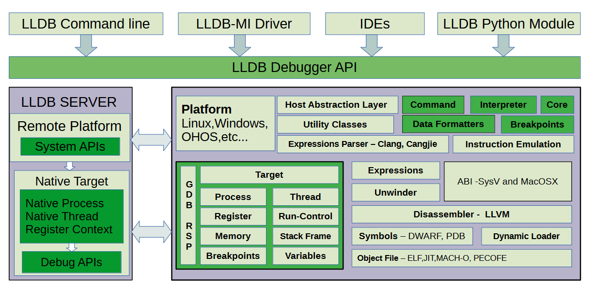

# `cjdb` 工具

## 简介

CJDB 是一款基于 `lldb` 开发的仓颉程序命令行调试工具。当前 `cjdb` 工具是在[llvm15.0.4](https://github.com/llvm/llvm-project/releases/tag/llvmorg-15.0.4)基础上适配演进出来的工具。为仓颉开发者提供程序调试的能力。了解更多仓颉调试器的介绍，请参阅 [调试工具](https://cangjie-lang.cn/docs?url=%2F1.0.0%2Ftools%2Fsource_zh_cn%2Ftools%2Fcjdb_manual_cjnative.html)。

本仓提供了 cjdb 调试工具源码，整体框架如下图展示：



## 目录结构

```text
lldb/
├─bindings                      # 各种语言与LLDB交互的绑定代码
├─cmake                         # Cmake构建系统相关的配置文件
├─docs                          # 文档
├─examples                      # 示例代码
├─include                       # 公共头文件
├─packages                      # 打包脚本
├─resources                     # 运行所需各类资源文件
├─scripts                       # 辅助脚本
├─source                        # 核心源代码目录，Plugins包含cangjie扩展
├─test                          # 测试脚本及测试用例
├─third_party                   # 三方库
├─tools                         # 与LLDB集成的工具
├─unittests                     # 单元测试
└─utils                         # 通用工具类和辅助函数
```

## 约束

支持在 Ubuntu/MacOS(x86_64, aarch64) 环境中对仓颉调试器进行构建。更详细的环境及工具依赖请参阅 [构建环境指导书](https://gitcode.com/Cangjie/cangjie_build)。

## 编译构建

下载源码：

```shell
$ git clone https://gitcode.com/Cangjie/cangjie-compiler.git -b release-cangjie-merged;
```

### 构建步骤

```shell
$ cd cangjie-compiler
$ python3 build.py clean
$ python3 build.py build -t release --build-cjdb
$ python3 build.py install
```

1. `clean` 命令用于清空工作区临时文件；
2. `build` 命令开始执行编译，选项 `-t` 即 `--build-type`，指定编译产物类型，可以是 `release` 或 `debug`；
3. `install` 命令将编译产物安装到 `output` 目录下。

`output` 目录结构如下：

```text
./output
├── bin                     # 仓颉可执行文件
├── envsetup.sh             # 一键环境变量配置脚本
├── include                 # 编译前端对外头文件
├── lib                     # 仓颉编译产物依赖库，子文件夹按照目标平台拆分
├── modules                 # 仓颉标准库 cjo 文件预留文件夹，子文件夹按照目标平台拆分
├── runtime                 # 仓颉编译产物依赖运行时库
├── third_party             # llvm 等第三方依赖二进制及库
└── tools                   # 仓颉工具
│   ├── bin                 # 包含CJDB可执行文件
│   ├── config
│   └── lib
```

### 更多构建选项

如需了解更多构建选项，请参阅 [build.py 构建脚本](./build.py) 或通过 `--help` 选项查看。

```shell
$ python3 build.py --help
```

### 集成构建指导

集成构建请参阅 [仓颉 SDK 集成构建指导书](https://gitcode.com/Cangjie/cangjie_build/blob/main/README_zh.md)。

## 相关仓

- [仓颉工具](https://gitcode.com/Cangjie/cangjie-tools/tree/release-cangjie-merged)：提供仓颉工具套，包含代码格式化、包管理等工具。
- [仓颉语言开发指南](https://gitcode.com/Cangjie/cangjie-docs/tree/release-cangjie-merged/docs/dev-guide)：提供仓颉语言开发使用指南；
- [仓颉语言标准库](https://gitcode.com/Cangjie/cangjie-runtime/tree/release-cangjie-merged/runtime)：提供仓颉标准库源码；
- [仓颉运行时](https://gitcode.com/Cangjie/cangjie-runtime/tree/release-cangjie-merged/std)：提供仓颉语言所必需的标准库代码；
